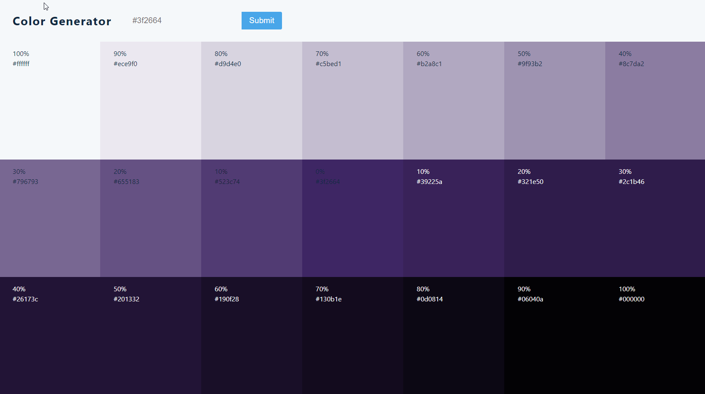

<h1 align="center">
  Color Shades Generator
</h1>

## 💻 Project

- Learning ReactJS;
- Working with form and inputs.

&nbsp;&nbsp;

---

## 🔥 Check it out!

 

- [https://color-generator-app.netlify.app/](https://color-generator-app.netlify.app/)

  

&nbsp;&nbsp;

